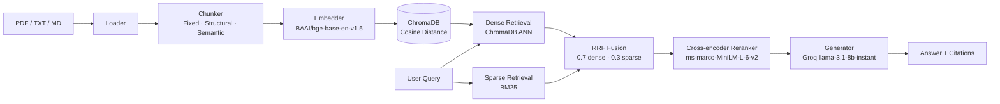

# HybridRAG — Production-grade RAG Hybrid Search

A production-grade Retrieval-Augmented Generation system that answers questions
from uploaded documents using hybrid search (dense vector + sparse BM25), a
cross-encoder reranker, and grounded generation with citation verification.
Deliberately avoided LangChain in the retrieval layer to demonstrate
deep internals knowledge.

## Architecture



### Component decisions

- **Loader** — pypdf for PDF, native for txt/md. Limitation: strips PDF structure signals.
- **Chunker** — three strategies implemented from scratch. Fixed chunking won for flat PDFs (structural/semantic degrade to 1-2 chunks without heading markers).
- **Embedder** — BAAI/bge-base-en-v1.5, top-3 MTEB retrieval benchmark, free, local, normalize_embeddings=True required for cosine similarity.
- **ChromaDB** — persistent vector store with hnsw:space cosine, coupled with normalized embeddings.
- **RRF Fusion** — weights 0.7 dense / 0.3 sparse, k=60 (TREC validated default).
- **Reranker** — cross-encoder/ms-marco-MiniLM-L-6-v2, reranks top 20 candidates to top 5.
- **Generator** — Groq llama-3.1-8b-instant via OpenAI-compatible API. Provider swappable via .env.

## Eval Results

Scored on first 5 questions of a 15-question hand-written golden test set
using RAGAS 0.1.21 against the `rag_fixed` collection.

| Metric | Score |
|---|---|
| faithfulness | 0.614 |
| context_precision | 0.990 |
| context_recall | 0.900 |
| answer_relevancy | 0.857 |

## Quick Start

### Local

```bash
cp .env.example .env
# Add GROQ_API_KEY to .env

uv sync
uv run uvicorn api.main:app --reload   # Terminal 1
uv run streamlit run app.py            # Terminal 2
```

Open `http://localhost:8501` — upload a document first, then query it.

### Docker

```bash
cp .env.example .env
# Add GROQ_API_KEY to .env

docker-compose up --build
```

- Streamlit UI → `http://localhost:8501`
- Swagger UI → `http://localhost:8000/docs`

On first run, use the Upload tab to ingest a document before querying.

## API Endpoints

| Method | Path | Description |
|---|---|---|
| POST | /query | Submit a question against a collection |
| POST | /ingest | Upload one or more documents for indexing |
| GET | /collections | List all collections with chunk counts |
| GET | /health | System status, model info, collection stats |

## Stack

| Component | Technology | Reason |
|---|---|---|
| Embeddings | BAAI/bge-base-en-v1.5 | Top MTEB, free, local |
| Vector store | ChromaDB | Persistent, cosine distance, no infra |
| Sparse retrieval | rank_bm25 | No server, pure Python |
| Reranker | ms-marco-MiniLM-L-6-v2 | Free, local, strong precision |
| LLM | Groq llama-3.1-8b-instant | Free tier, OpenAI-compatible |
| API | FastAPI | Typed, async, auto Swagger |
| UI | Streamlit | ML-native, zero frontend code |
| Eval | RAGAS 0.1.21 | Standard RAG metrics |
| Packaging | uv | Fast, deterministic |
| Container | Docker + Compose | One command deploy |

## Key Design Decisions

- **No LangChain in retrieval** — built from scratch to understand internals deeply. LangChain used only inside RAGAS eval internals.
- **Fixed chunking won** — structural and semantic chunking degraded to 1-2 chunks on flat PDF text because pypdf strips heading markers. Fixed at 43 chunks is the proven sweet spot for this document type.
- **Config-driven provider swap** — all LLM config in Pydantic BaseSettings. Switching from Groq to OpenRouter or Ollama is a three-line .env change, zero code changes.
- **RRF 0.7/0.3** — TREC-validated default. Dense retrieval weighted higher for semantic questions; sparse retained for exact-match keyword queries.
- **Lazy singleton pattern** — embedding model and ChromaDB client loaded once per process, cached by collection name.

## Running Tests

```bash
uv run pytest tests/ -v
```

Expected: 95 passing. The Windows-only PermissionError after the session is a pytest tmp-dir cleanup artifact, not a test failure.

## Known Limitations

- Groq free tier: 500k tokens/day, ~26s latency per query (paid tier: ~3-5s)
- Structural/semantic chunking degrades on flat PDFs — pypdf strips document structure
- Re-ingestion requires deleting `chroma_db/` first — UUID per run breaks upsert idempotency
- Docker image ~2.5GB due to CPU torch dependency from sentence-transformers

## Roadmap

- `pymupdf` loader for structure-aware PDF parsing
- Chunking router — auto-select strategy per document type
- Async ingest endpoint with job queue
- LangChain version for side-by-side comparison
- GitHub Actions CI for automated test runs